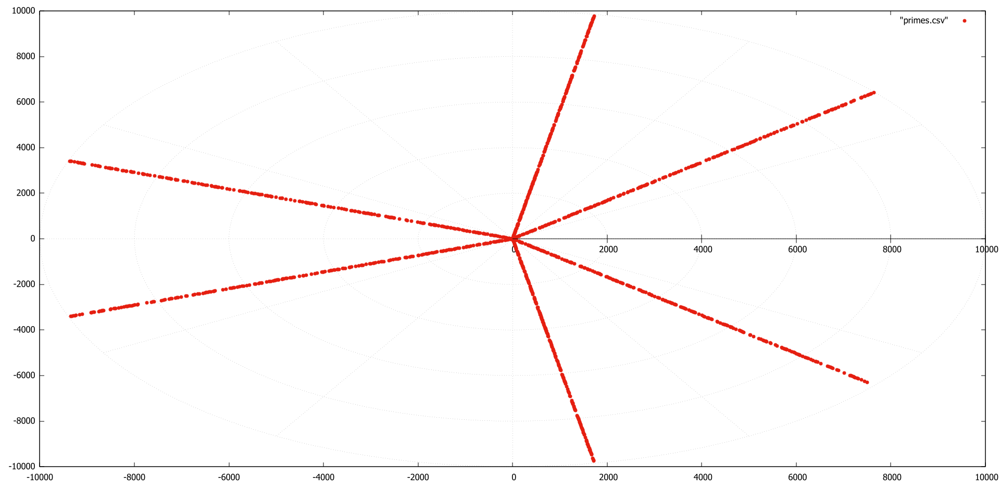

# Visualise Prime Numbers to find pattern emergence

Prime numbers are cool and unpredictable.

I'm not good at math, it goes over my head most of the time.

But My friend [Sai Kiran Reddy Lenkala](https://github.com/100193kiran) is , I'll try to visualise his experiments on prime numbers in this repo and maybe learn something along the way

## Requirements

- Python
- Gnuplot

## Generate primes.csv

change the argument to generate primes till that number

```python
python sieve.py 10000
```

## Plot primes.csv

```bash
gnuplot -p primes.gnuplot
```

## Latest plot

This is a polar plot `(r,Θ)` with `r = prime number` and `Θ = (sum of its digits / 9) * 360`

for prime number `73`

```math
r = 73

sum of its digits = 7 + 3 => 10 = 1 + 0 => 1

Θ = (1 / 9) * 360 = 40°
```


